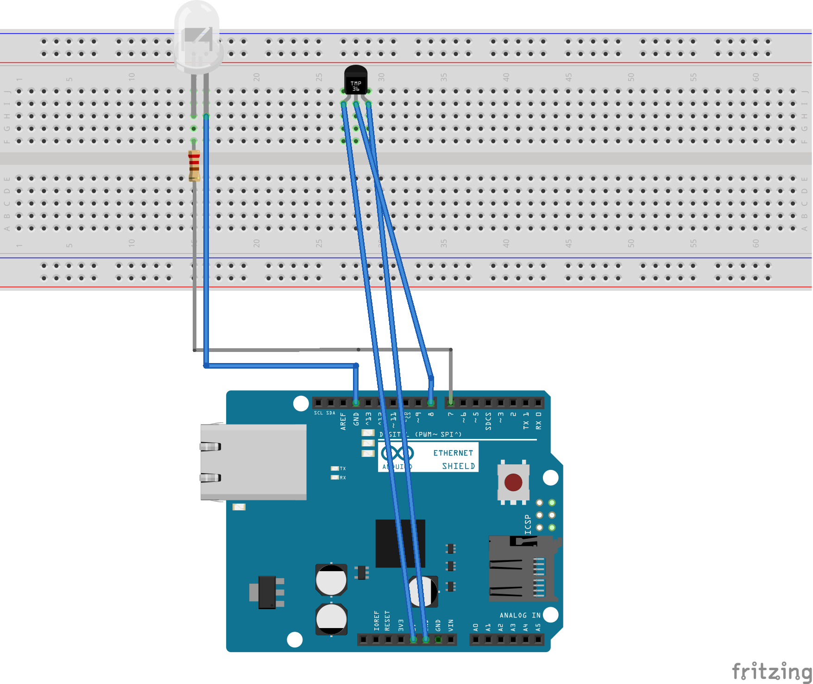

**blynk server with aduino uno rev.2**

The Arduino UNO WiFi Rev.2 is the easiest point of entry to basic IoT with the standard form factor of the UNO family. Whether you are looking at building a sensor network connected to your office or home router, or if you want to create a BLE device sending data to a cellphone, the Arduino UNO WiFi Rev.2 is your one-stop-solution for many of the basic IoT application scenarios. Add this board to a device and you'll be able to connect it to a WiFi network, using its secure ECC608 crypto chip accelerator. The Arduino Uno WiFi is functionally the same as the Arduino Uno Rev3, but with the addition of WiFi / Bluetooth and some other enhancements. It incorporates the brand new ATmega4809 8-bit microcontroller from Microchip and has an onboard IMU (Inertial Measurement Unit) LSM6DS3TR. The Wi-Fi Module is a self-contained SoC with integrated TCP/IP protocol stack that can provide access to a Wi-Fi network, or act as an access point. It is the u-blox NINA-W102 and (here) you find the datasheet. The Arduino UNO WiFi Rev.2 has 14 digital input/output pins—5 can be used as PWM outputs—6 analog inputs, a USB connection, a power jack, an ICSP header, and a reset button. It contains everything needed to support the microcontroller. Simply connect it to a computer with a USB cable or power it with an AC adapter or battery to get started.

